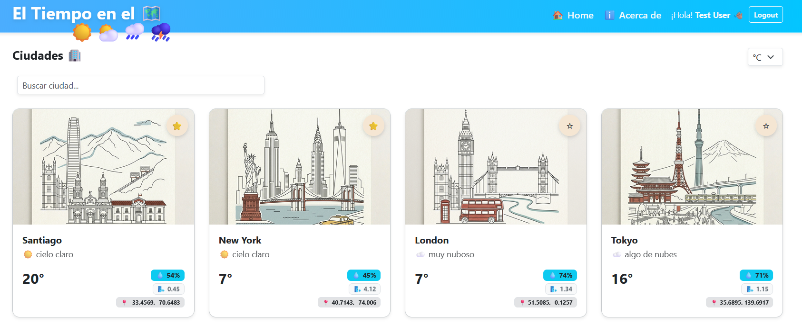
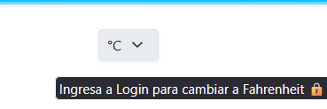
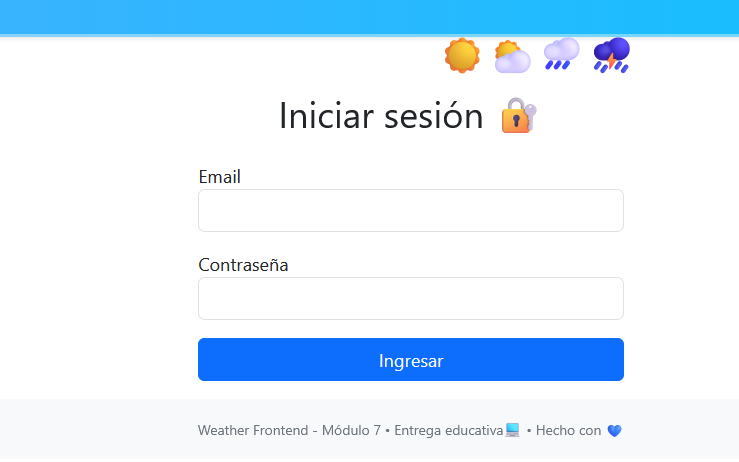
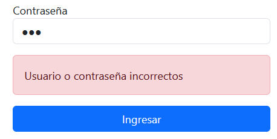
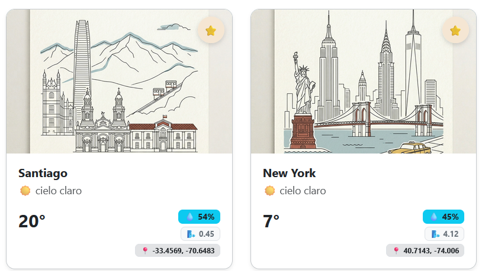
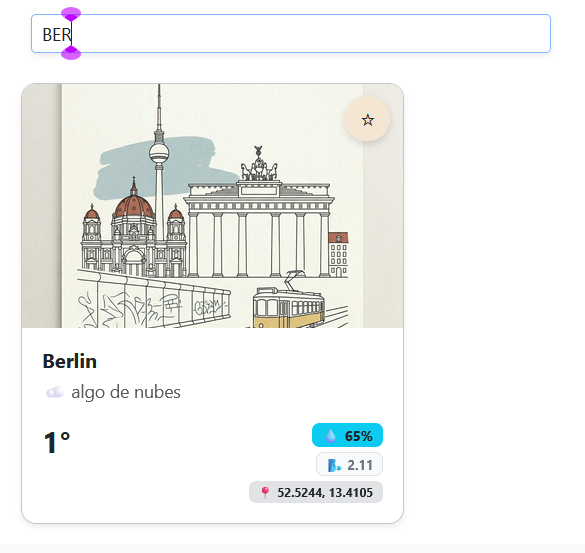
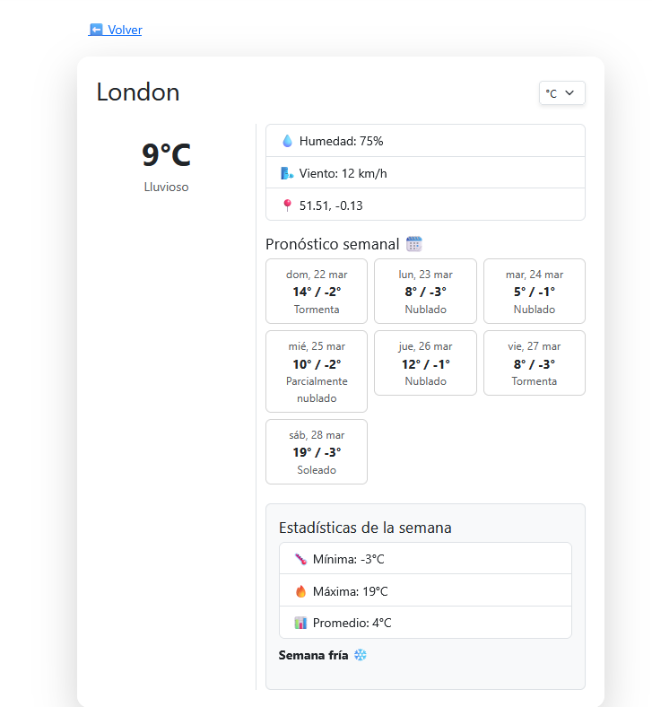
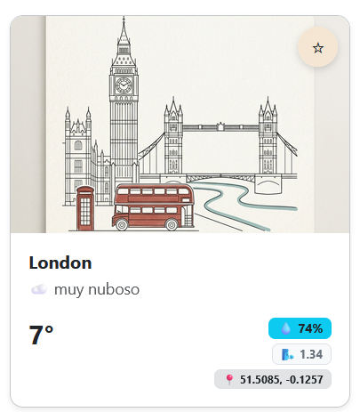

# 🌤️ App del Clima - Vue 3 (Usuarios, Login,  Estado Global, Cosumo de API de clima) Módulo 8

Aplicación web SPA desarrollada en Vue 3 que permite consultar el clima de distintas ciudades, visualizar pronóstico semanal y gestionar preferencias del usuario.

Consume datos en tiempo real desde una API externa e implementa manejo de estado global con Vuex, incluyendo estadísticas y alertas meteorológicas.


## 🚀 Demo en Vivo

Puedes probar la aplicación funcionando aquí:  

👉 [https://christelita.github.io/App-Clima/](https://christelita.github.io/App-Clima/)

## 📦 Repositorio

👉 https://github.com/christelita/App-Clima.git

## ✨ Funcionalidades principales

🔍 Búsqueda de ciudades
🌡️ Visualización de clima actual y pronóstico semanal
📊 Cálculo de estadísticas meteorológicas
⚠️ Generación de alertas climáticas
⭐ Sistema de favoritos
🔐 Autenticación simulada
🎨 Interfaz moderna y responsiva

## 🧭 Estructura de la aplicación (SPA)

Home → Listado de ciudades con clima actual
Detalle de ciudad → Pronóstico extendido + estadísticas
Favoritos → Gestión personalizada (requiere login)

## 🌐 Consumo de API

La aplicación obtiene datos reales desde OpenWeather API mediante Axios:

Temperatura actual
Estado del clima
Humedad
Velocidad del viento
Coordenadas geográficas

🔐 La API key se gestiona mediante variables de entorno (.env), evitando exponer credenciales sensibles en el código.

## ⚙️ Manejo de estados

⏳ Estado de carga ("cargando...")
❌ Manejo de errores en la API
🔄 Actualización dinámica de datos

## 🗃️ Manejo de estado global (Vuex)

La aplicación utiliza Vuex para centralizar:

Lista de ciudades
Ciudad seleccionada
Pronóstico del clima
Preferencias del usuario (°C / °F)
Estados de carga y error


## 📊 Estadísticas y Alertas

A partir de los datos obtenidos desde la API, la app genera:

## 📈 Estadísticas semanales

Temperatura mínima
Temperatura máxima
Temperatura promedio
Conteo de condiciones climáticas

## ⚠️ Alertas meteorológicas

🌡️ Ola de calor (temperaturas altas consecutivas)
🌧️ Semana lluviosa (frecuencia de precipitaciones)

📌 Nota: Las estadísticas meteorológicas y la gestión de favoritos están disponibles para usuarios autenticados. Esto permite que cada persona vea información personalizada según sus preferencias y ciudades favoritas.

## 🔐 Sistema de Usuarios 

La aplicación incluye autenticación simulada:

Inicio de sesión
Persistencia en Vuex
Personalización de experiencia

## 👤 Datos por usuario:
Nombre
Preferencia de unidad de temperatura (°C / °F)
Ciudades favoritas

## 🛣️ Rutas protegidas
/login → Inicio de sesión
/favoritos → Solo usuarios autenticados

📌 Redirección automática a login si no está autenticado.

## 🛠️ Tecnologías utilizadas
 
Vue 3
Vite
Vue Router
Vuex
Axios
Bootstrap 5
JavaScript (ES6+)
OpenWeather API


## ▶️ Cómo ejecutar el proyecto
Si deseas explorar el código o realizar mejoras en tu entorno local, sigue estos pasos:

1. Clonar el repositorio: git clone https://github.com/christelita/App-Clima.git  
2. Entrar al proyecto: cd clima-app  
3. Instalar dependencias: npm install  
4. Crear archivo .env y agregar su VITE_WEATHER_API_KEY.
5. Ejecutar: npm run dev 
6. Abrir: http://localhost:5173  


## 🗂️ Estructura del Proyecto

A continuación se detalla la organización de carpetas y archivos principales del proyecto:

```text
App-Clima/
├── .github/workflows/    # Configuración de GitHub Actions (Despliegue)
├── dist/                 # Archivos compilados para producción (Generado)
│   ├── assets/           # CSS y JS minificados
│   └── index.html        # Punto de entrada en servidor
├── node_modules/         # Dependencias del proyecto
├── public/               # Recursos estáticos públicos
│   └── assets/cities/    # Imágenes decorativas de ciudades
├── screenshots/          # Capturas de pantalla para documentación
├── src/                  # Código fuente de la aplicación
│   ├── assets/           # Recursos procesados (CSS Global)
│   ├── components/       # Componentes reutilizables de Vue
│   ├── data/             # Datos estáticos y archivos de configuración (cities.js)
│   ├── router/           # Configuración de rutas (Vue Router)
│   ├── services/         # Servicios para llamadas a API (Axios/WeatherService)
│   ├── stores/           # Manejo de estado global (Vuex)
│   ├── views/            # Vistas principales (Home, Login, Detail, About)
│   ├── App.vue           # Componente raíz
│   └── main.js           # Archivo de entrada de JavaScript
├── .env                  # Variables de entorno (Ignorado por Git)
├── .gitignore            # Archivos excluidos del repositorio
├── index.html            # Plantilla HTML principal
├── package.json          # Scripts y dependencias del proyecto
└── vite.config.js        # Configuración de Vite
```

---

## 📸 Capturas del proyecto App-Clima


A continuación se muestran las diferentes pantallas de la aplicación:

---
## 🏠 Home


---
## 🔐 Solicitud de Login para cambio de temperatura


## 📝 Login


## ❌ Usuario Incorrecto


---
## ⭐ Favoritos (Ciudades marcadas con estrella)


## 🔍 Buscador de Ciudad


---
## 📍 Detalle de ciudad


## 🃏 Card Icono Badges (humedad, viento y coordenadas)



---
 
## 🧠 Aprendizajes

Durante este proyecto se reforzó:

- Manejo de estado global con Vuex
- Navegación con Vue Router
- Componentización en Vue
- Mejora de experiencia de usuario (UX/UI)
- Organización de código en proyectos reales

---

## 👩‍💻 Autora

Desarrollado por **Christel, Front End Trainee 💙**

Proyecto realizado en el contexto de formación de **SENCE Chile**

---

## 📌 Estado del proyecto

🚧 En constante mejora (UI, animaciones y nuevas funcionalidades)